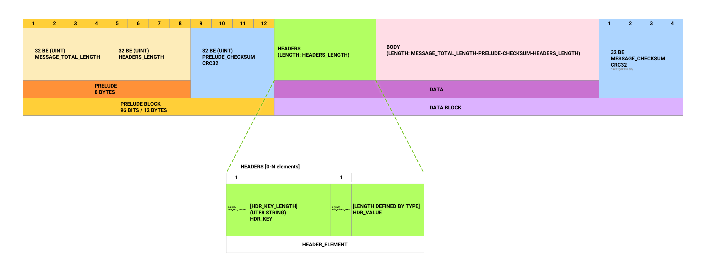
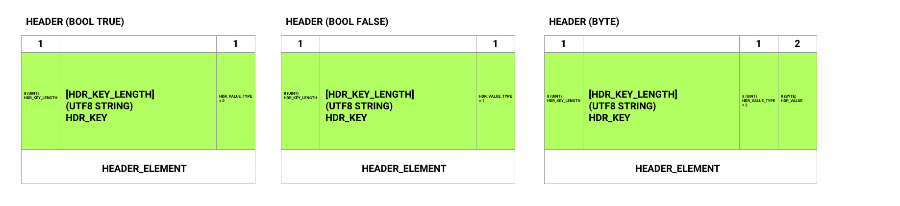

# AWS Event Stream Parser

Rust implementation of the `vnd.amazon.event-stream`-binary format

Implementation is based on following:
- https://docs.aws.amazon.com/AmazonS3/latest/API/RESTObjectSELECTContent.html#RESTObjectSELECTContent-responses
- https://github.com/awslabs/aws-c-event-stream
- https://github.com/aws/aws-sdk-ruby/
- https://github.com/lifion/lifion-aws-event-stream

## Installation

Add this to your **Cargo.toml**:

```toml
[dependencies]
aws_event_stream_parser = "0.0.3"
```

## Usage


### Plain parser
```rust
extern crate aws_event_stream_parser;

use aws_event_stream_parser::parse_message;
let res = parse_message(&hex!("0000003d0000002007fd83960c636f6e74656e742d747970650700106170706c69636174696f6e2f6a736f6e7b27666f6f273a27626172277d8d9c08b1")).unwrap();

println!("{:?}", res);
/*
([], Message {
  prelude: PreludeBlock {
    total_length: 61,
    - headers_length: 32,
    checksum: 134054806
  },
  headers: HeaderBlock {
    headers: [
      Header { key: "content-type", value: String("application/json") }
    ]
  },
  body: [123, 39, 102, 111, 111, 39, 58, 39, 98, 97, 114, 39, 125],
  checksum: 2375813297 })
*/
println!("{:?}", res.1.valid());
// true

```

### Framed codec
(more information from https://tokio.rs/docs/going-deeper/frames/ )


```rust
use aws_event_stream_parser::EventStreamCodec;

TcpStream::connect(&addr).and_then(|sock| {
    let framed_sock = Framed::new(sock, EventStreamCodec::new());
    framed_sock.for_each(|line| {
        println!("Received line {}", line);
        Ok(())
    })
});
```


## Specification

This parser has been modeled based on AWS documentation and other protocol implementations.
We have also documented the format for future implementations.



### Header diagrams



## Contributing
Pull requests are welcome. For major changes, please open an issue first to discuss what you would like to change.

Please make sure to update tests as appropriate.

## License
[MIT](https://choosealicense.com/licenses/mit/)
